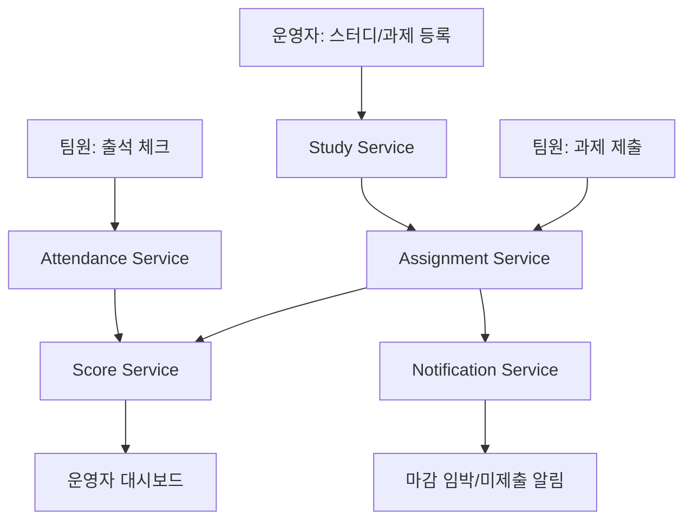

# 스터디 출석/과제 관리 플랫폼

## 한 줄 소개

스터디나 팀 프로젝트에서 출석 확인, 과제 등록, 제출 상태 확인, 미제출자 알림, 참여 점수 계산을 하나의 흐름으로 관리하는 협업 기반 플랫폼입니다.

## 개요

현재 스터디나 프로젝트에서는 출석 체크와 과제 제출 여부를 카카오톡, 노션, 구글폼, 엑셀 등 여러 도구로 나누어 관리하는 경우가 많습니다.

이 방식은 처음에는 간단하지만 인원이 늘어나면 출석 누락, 과제 미제출 확인 지연, 마감 시간 혼동, 참여도 계산 오류가 자주 발생합니다.

이 서비스는 이런 문제를 해결하기 위해 스터디 운영자가 주차별 일정과 과제를 등록하고, 팀원은 출석과 과제 제출을 시스템 안에서 처리할 수 있도록 설계합니다.

## 해결하려는 문제

- 출석 체크가 채팅방이나 수기로 이루어져 누락되기 쉽습니다.
- 과제 제출 여부를 운영자가 직접 확인해야 해서 시간이 많이 듭니다.
- 마감 시간이 지난 뒤 미제출자를 찾는 과정이 번거롭습니다.
- 출석률, 과제 제출률, 지각 여부를 기준으로 참여도를 계산하기 어렵습니다.
- 팀 프로젝트나 스터디 운영 과정이 기록으로 남지 않아 회고와 평가가 어렵습니다.

## 서비스 목표

- 출석, 과제, 알림, 점수 계산을 하나의 서비스 흐름으로 연결합니다.
- 운영자는 주차별 진행 상황을 대시보드에서 확인할 수 있습니다.
- 팀원은 본인의 출석 상태와 과제 제출 상태를 바로 확인할 수 있습니다.
- 제출 시간, 마감 시간, 출석 시간을 기준으로 명확한 비즈니스 규칙을 적용합니다.
- Jira, GitHub, TDD, MSA, Spring Boot, DBMS, Redis, 비동기 처리 등 수업에서 배운 기술을 자연스럽게 조합합니다.

## 전체 서비스 구조

| 서비스 | 역할 | 주요 데이터 |
|---|---|---|
| User Service | 사용자, 권한, 팀원 정보 관리 | 사용자, 역할, 팀 소속 정보 |
| Study Service | 스터디 생성, 주차별 일정 관리 | 스터디, 주차, 일정 |
| Attendance Service | 출석 체크, 지각/결석 처리 | 출석 기록, 출석 상태 |
| Assignment Service | 과제 등록, 제출, 마감 처리 | 과제, 제출 기록, 제출 상태 |
| Notification Service | 마감 임박, 미제출자 알림 처리 | 알림 메시지, 발송 상태 |
| Score Service | 출석률과 제출률 기반 참여 점수 계산 | 점수, 참여도, 집계 결과 |

## 처리 흐름

1. 운영자가 스터디를 생성하고 팀원을 등록합니다.
2. 운영자가 주차별 스터디 일정과 과제를 등록합니다.
3. 출석 시간이 열리면 팀원이 출석 체크를 진행합니다.
4. 시스템은 출석 가능 시간인지 확인하고 정상 출석, 지각, 결석 상태를 구분합니다.
5. 팀원이 과제를 제출하면 시스템은 마감 시간 이전 제출인지 확인합니다.
6. 마감 시간이 지나면 시스템이 미제출자를 자동으로 조회합니다.
7. Notification Service는 미제출자 또는 마감 임박 대상자에게 알림을 보냅니다.
8. Score Service는 출석 기록과 과제 제출 기록을 기반으로 참여 점수를 계산합니다.
9. 운영자는 대시보드에서 주차별 출석률, 제출률, 미제출자, 참여 점수를 확인합니다.

## 시스템 흐름도



## 활용 기술

| 구분 | 적용 기술 | 활용 목적 |
|---|---|---|
| Language | Kotlin 또는 Java | Spring Boot 기반 서버 로직 작성 |
| Framework | Spring Boot | REST API, 계층형 아키텍처, 의존성 주입 구성 |
| API | REST API, GraphQL 선택 적용 | 출석/과제 요청 처리, 대시보드 조회 최적화 |
| DBMS | RDBMS | 사용자, 스터디, 과제, 출석, 제출 기록 저장 |
| In-memory DB | Redis | 중복 출석 방지, 중복 제출 방지, 알림 큐, 빠른 상태 조회 |
| 비동기 처리 | Coroutine, async 처리 | 알림 발송, 마감 처리, 점수 집계 작업 분리 |
| Container | Docker, Docker Compose | 서버와 DB 실행 환경 구성 |
| 협업 관리 | Jira, GitHub | 이슈 기반 역할 분담, PR 기반 기록 관리 |
| 테스트 | TDD, JUnit, Mockito | 출석 판정, 제출 상태, 점수 계산 로직 검증 |

## Spring Boot 어노테이션 활용

| 어노테이션 | 적용 위치 | 활용 이유 |
|---|---|---|
| `@RestController` | 출석, 과제, 점수 API | 외부 요청을 JSON 응답으로 처리 |
| `@PostMapping` | 출석 체크, 과제 제출 | 사용자의 생성 요청 처리 |
| `@GetMapping` | 출석 현황, 제출 현황 조회 | 운영자 대시보드 데이터 조회 |
| `@RequestBody` | 출석/제출 요청 DTO | 클라이언트가 보낸 JSON 데이터를 DTO로 변환 |
| `@PathVariable` | 스터디 ID, 과제 ID 조회 | URL 경로 기반 리소스 식별 |
| `@Service` | 출석 판정, 제출 상태 변경, 점수 계산 | 핵심 비즈니스 로직 분리 |
| `@Repository` | DB 조회 및 저장 | 데이터 접근 계층 분리 |
| `@Entity` | User, Study, Assignment, Attendance | DB 테이블과 객체 매핑 |
| `@Transactional` | 출석 저장, 과제 제출, 점수 반영 | 중간 실패 시 데이터 롤백 |
| `@Scheduled` | 마감 시간 이후 미제출자 확인 | 자동 마감 처리 |

## 커스텀 어노테이션 활용 예시

중복 출석이나 중복 제출을 막기 위해 커스텀 어노테이션을 적용할 수 있습니다.

예를 들어 `@SubmissionLock` 어노테이션을 만들고 AOP로 처리하면, 같은 사용자가 같은 과제에 동시에 여러 번 제출 요청을 보내더라도 하나의 요청만 처리되도록 제한할 수 있습니다.

```kotlin
@Target(AnnotationTarget.FUNCTION)
@Retention(AnnotationRetention.RUNTIME)
annotation class SubmissionLock
```

```kotlin
@SubmissionLock
@PostMapping("/assignments/{assignmentId}/submissions")
fun submitAssignment(
    @PathVariable assignmentId: Long,
    @RequestBody request: SubmitAssignmentRequest,
) {
    assignmentService.submit(assignmentId, request)
}
```

이 구조는 교수님 자료에서 설명한 것처럼 어노테이션 자체가 기능을 수행하는 것이 아니라, 스프링 AOP가 해당 어노테이션을 읽고 공통 로직을 대신 수행하는 방식입니다.

## TDD 적용 계획

### Small Test

비즈니스 규칙 하나를 빠르게 검증합니다.

- 출석 시간이 시작 전이면 출석을 허용하지 않는다.
- 출석 시간이 지났지만 지각 허용 시간 안이면 `LATE` 상태가 된다.
- 과제 마감 전 제출은 `SUBMITTED` 상태가 된다.
- 과제 마감 후 제출은 `LATE_SUBMITTED` 상태가 된다.
- 출석률과 제출률을 기준으로 참여 점수가 계산된다.

### Medium Test

서비스와 저장소가 함께 동작하는 흐름을 검증합니다.

- 출석 체크 요청이 들어오면 출석 기록이 저장된다.
- 같은 사용자가 같은 주차에 중복 출석할 수 없다.
- 과제 제출 시 제출 기록이 저장된다.
- 마감 시간이 지난 과제의 미제출자를 조회할 수 있다.
- 점수 계산 시 출석 기록과 과제 제출 기록이 함께 반영된다.

### Large Test

여러 서비스가 연결된 실제 사용 흐름을 검증합니다.

- 운영자가 과제를 등록하고 팀원이 제출한 뒤 제출 현황을 조회한다.
- 마감 시간이 지나면 미제출자 알림 대상이 생성된다.
- 출석 기록과 과제 제출 기록을 기반으로 대시보드 점수가 갱신된다.
- 동시에 여러 출석 요청이 들어와도 한 명당 하나의 출석만 저장된다.

## Jira 이슈 관리 예시

| 타입 | 이슈명 | 설명 |
|---|---|---|
| Epic | 스터디 운영 관리 | 스터디 생성, 주차 일정, 팀원 관리 |
| Epic | 출석 관리 | 출석 체크, 지각/결석 판정, 중복 출석 방지 |
| Epic | 과제 관리 | 과제 등록, 제출, 마감 처리, 미제출자 조회 |
| Epic | 알림 관리 | 마감 임박 알림, 미제출자 알림 |
| Story | 출석 체크 API 작성 | 팀원이 출석 버튼을 눌렀을 때 상태를 저장 |
| Story | 과제 제출 API 작성 | 팀원이 과제를 제출하고 상태를 기록 |
| TDD | 출석 상태 판정 테스트 | 정상 출석, 지각, 결석 기준 검증 |
| TDD | 과제 제출 상태 테스트 | 정상 제출, 지각 제출, 미제출 기준 검증 |
| Task | Redis 중복 요청 방지 설계 | 같은 사용자의 중복 출석/제출 요청 제한 |
| Task | README 및 설계 문서 정리 | 기술 선택 이유와 처리 흐름 문서화 |

## 트러블슈팅 예상 시나리오

| 문제 상황 | 원인 | 해결 방향 |
|---|---|---|
| 같은 사용자가 출석 버튼을 여러 번 누름 | 중복 요청 발생 | Redis Lock 또는 중복 키로 한 번만 처리 |
| 마감 시간 직전에 제출 요청이 몰림 | 동시에 제출 상태 변경 | 트랜잭션과 서버 기준 시간으로 상태 판정 |
| 알림 발송 중 일부 실패 | 외부 알림 시스템 장애 | 실패 로그 저장 후 재시도 큐 처리 |
| 출석 저장은 됐지만 점수 계산이 실패 | 서비스 간 처리 순서 문제 | 이벤트 기반 재계산 또는 보상 처리 |
| 운영자 대시보드 조회가 느림 | 출석/제출 데이터를 매번 집계 | Redis 캐시 또는 집계 테이블 사용 |

## 평가 기준 대응

| 평가 항목 | 배점 | 대응 내용 |
|---|---:|---|
| 기술 적용도 | 25점 | Spring Boot, Kotlin/Java, REST API, DBMS, Redis, Coroutine, Docker, MSA, TDD를 출석/과제 관리 흐름에 맞게 조합할 수 있습니다. |
| 이슈 관리 | 15점 | Jira에서 Epic, Story, Task, TDD 이슈를 분리하기 좋습니다. 출석, 과제, 알림, 점수 계산처럼 기능 경계가 명확합니다. |
| 테스트 주도 개발 | 10점 | 출석 판정, 과제 제출 상태, 중복 제출 방지, 점수 계산처럼 Given/When/Then 테스트로 검증할 수 있는 규칙이 많습니다. |
| 트러블슈팅 | 10점 | 중복 출석, 동시 제출, 알림 실패, 마감 시간 경계값, 대시보드 조회 성능 등 실제 문제 상황을 설명하기 좋습니다. |
| 문서 구성 | 15점 | 서비스 개요, 구조, 처리 흐름, 기술 선택 이유, 테스트 계획, 이슈 예시, 트러블슈팅까지 README 형식으로 정리할 수 있습니다. |
| 창의성 | 5점 | 단순 CRUD가 아니라 스터디 운영에서 실제로 발생하는 출석 누락, 미제출 확인, 참여도 계산 문제를 자동화합니다. |
| 협업 과정 | 10점 | 서비스 단위로 역할을 나누기 쉽고, GitHub PR과 Jira 이슈를 통해 팀원별 진행 상황을 기록하기 좋습니다. |
| 발표 및 리뷰 대응 | 10점 | 운영자와 팀원 관점의 시나리오가 명확해서 발표 흐름을 만들기 쉽고, 왜 이 기술을 썼는지 설명하기 좋습니다. |

## 평가 기준 관점의 장점

이 주제는 과제 평가표에서 요구하는 항목과 잘 맞습니다.

첫째, 출석과 과제라는 익숙한 문제를 다루기 때문에 서비스 목적을 설명하기 쉽습니다. 동시에 단순 게시판보다 시간 판정, 상태 변경, 중복 요청 방지, 자동 알림, 점수 계산 같은 비즈니스 규칙이 명확합니다.

둘째, TDD 적용이 자연스럽습니다. 출석 시간이 언제인지, 마감 시간이 지났는지, 같은 사용자가 이미 제출했는지처럼 테스트로 먼저 정의할 수 있는 조건이 많습니다.

셋째, MSA 역할 분담이 쉽습니다. User, Study, Attendance, Assignment, Notification, Score처럼 서비스 경계를 나눌 수 있어 팀 프로젝트 구조와 잘 맞습니다.

넷째, Spring Boot 어노테이션 활용을 보여주기 좋습니다. `@RestController`, `@Service`, `@Repository`, `@Entity`, `@Transactional`, `@Scheduled`뿐만 아니라 `@SubmissionLock` 같은 커스텀 어노테이션과 AOP까지 확장할 수 있습니다.

다섯째, 발표와 리뷰 대응이 쉽습니다. 실제 스터디 운영자가 겪는 문제를 기준으로 설명할 수 있고, 기술을 왜 선택했는지 서비스 흐름 안에서 자연스럽게 말할 수 있습니다.

## 발표 시나리오 예시

1. 기존 스터디 운영에서는 출석, 과제, 미제출자 확인이 여러 도구에 흩어져 있다는 문제를 제시합니다.
2. 이 서비스를 통해 운영자는 주차별 일정과 과제를 등록하고, 팀원은 출석과 제출을 한 곳에서 처리한다고 설명합니다.
3. 출석 체크, 과제 제출, 미제출자 알림, 점수 계산으로 이어지는 처리 흐름을 보여줍니다.
4. 각 기능이 어떤 마이크로서비스로 분리되는지 설명합니다.
5. Spring Boot 어노테이션과 TDD가 어떤 부분에 적용되는지 설명합니다.
6. 평가 기준표의 기술 적용도, 이슈 관리, TDD, 트러블슈팅, 문서 구성 항목에 어떻게 대응되는지 정리합니다.

## 결론

스터디 출석/과제 관리 플랫폼은 실제 협업 상황에서 발생하는 문제를 해결하는 주제입니다.

출석, 과제, 알림, 점수 계산이라는 기능이 명확하게 나뉘기 때문에 MSA 구조로 설계하기 좋고, 각 기능에는 테스트로 검증할 수 있는 규칙이 많습니다.

따라서 이 주제는 수업에서 배운 기술을 단순히 나열하는 것이 아니라, 하나의 서비스 흐름 안에서 자연스럽게 활용할 수 있는 프로젝트 주제로 볼 수 있습니다.
